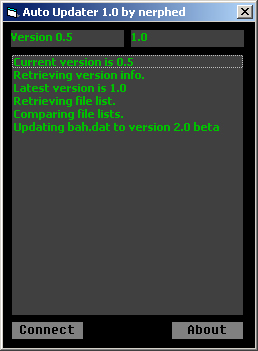



## Auto Updater

### Description

It connects to a server, downloads a version file and a list of files and their versions, compares them to local versions and updates as necesarry.
 
### More Info
 
A public variable holds the directory of all the update files. In this server directory, a file version.dat holds the latest version number, and files.dat holds a list of all files and their versions, 1 per line, as such:

bah.exe,1.2

foo.bar,2b

Just does some internet browsing and file reading/writing.

             |
---                |---
**Submitted On**   |2003-08-26 15:52:48
**By**             |[Michael Whitlock](https://github.com/Planet-Source-Code/PSCIndex/blob/master/ByAuthor/michael-whitlock.md)
**Level**          |Intermediate
**User Rating**    |4.0 (52 globes from 13 users)
**Compatibility**  |VB 6\.0
**Category**       |[Complete Applications](https://github.com/Planet-Source-Code/PSCIndex/blob/master/ByCategory/complete-applications__1-27.md)
**World**          |[Visual Basic](https://github.com/Planet-Source-Code/PSCIndex/blob/master/ByWorld/visual-basic.md)
**Archive File**   |[Auto\_Updat1635918262003\.zip](https://github.com/Planet-Source-Code/michael-whitlock-auto-updater__1-45859/archive/master.zip)

